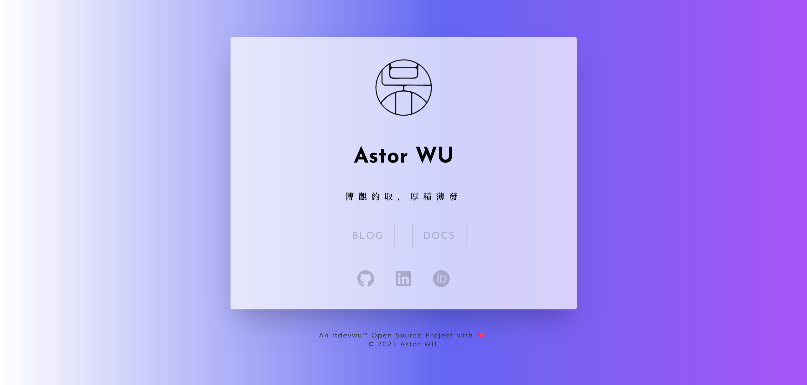

<div align="center">

<h1>MenMian（门面）</h1>

[中文 README](./README_ZH.md)

<a alt="itdevwu Open Source" href="https://docs.itdevwu.com"></img></a>
<a alt="Apache 2.0 License" href="./LICENSE"></a>


</div>

---

## Introduction

**MenMian** is a Next.js project designed to help you create a visually stunning **single landing page**, also known as a **homepage** or **index page**, to showcase your various websites or projects links, as well as your social media profiles.

*The name "MenMian" is derived from the Chinese term "门面" which refers to the facade or frontage of a building.*



## Usage

### Download

Clone the repository to your local machine:

```bash
git clone https://github.com/itdevwu/menmian.git
```

### Setup with Configuration

You can configure the project by editing the `user_info.json` file.

### Run

#### Test with Next.js

*pnpm is recommended for its speed and disk space efficiency.*

For pnpm:

```bash
pnpm run dev
```

#### Build

```bash
pnpm run build
```

And you can deploy the `out` directory to your server.

## Copyright

Copyright © 2023-present itdevwu. All rights reserved.

Licensed under the *[Apache License 2.0](./LICENSE)*.

