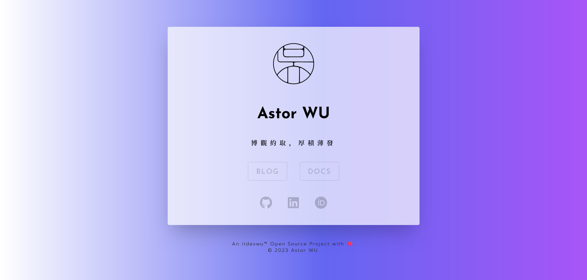

<div style="margin: auto; text-align: center; align-items: center">

<h1>MenMian（门面）</h1>

[English README](./README.md)

<a alt="itdevwu Open Source" href="https://docs.itdevwu.com"></img></a>
<a alt="Apache 2.0 License" href="./LICENSE"></a>


</div>

---

## 介绍

**门面**是一个 Next.js 项目，旨在创建一个外观华丽的 **单个落地页**，也称 **主页** 或 **索引页面**，以展示用户的各种网站或项目链接，以及社交媒体资料。



## 使用方法

### 下载

将仓库克隆到本地：

```bash
git clone https://github.com/itdevwu/menmian.git
```

### 配置设置

你可以通过编辑 `user_info.json` 文件来配置这个项目。

### 运行

#### 使用 Next.js 进行测试

*推荐使用 pnpm，速度快，占用磁盘空间少。*

对于 pnpm:

```bash
pnpm run dev
```

#### 构建

```bash
pnpm run build
```

之后，你可以将 `out` 目录部署到你的服务器上。

## 版权

版权所有 © 2023-present itdevwu. 保留所有权利.

以 *[Apache License 2.0](./LICENSE)* 协议授权.
